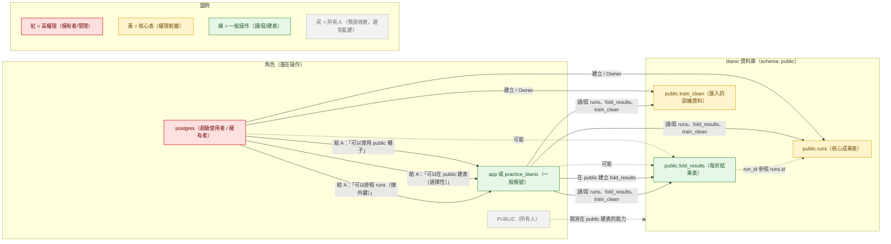
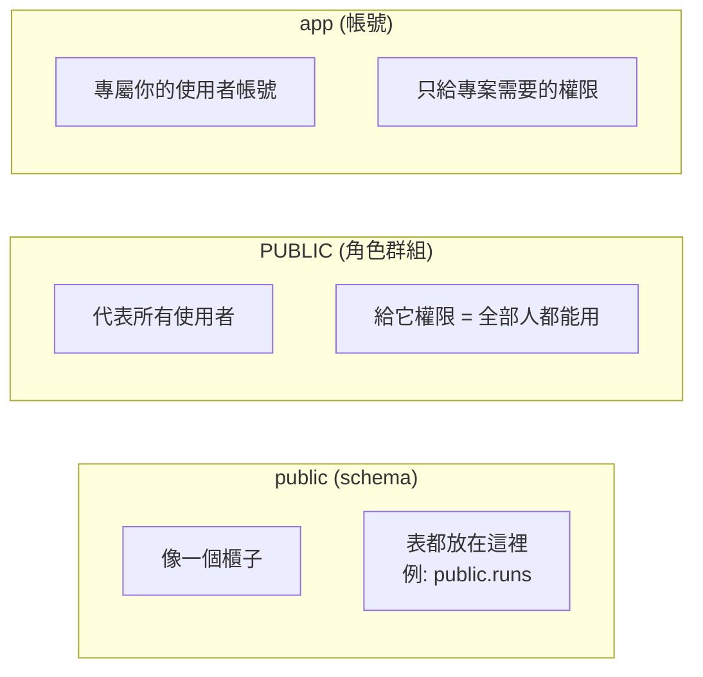

```mermaid
flowchart LR
  %% 區域：資料庫與物件
  subgraph DB["titanic 資料庫（schema: public）"]
    R["public.runs（核心成果表）"]
    F["public.fold_results（每折結果表）"]
    T["public.train_clean（匯入的訓練資料）"]
  end

  %% 區域：角色（人/帳號）
  subgraph ROLES["角色（誰在操作）"]
    P["postgres（超級使用者 / 擁有者）"]
    A["app 或 practice_titanic（一般帳號）"]
    G["PUBLIC（所有人）"]
  end

  %% 擁有關係（Owner = 最高掌控權）
  P -->|建立 / Owner| R
  P -->|建立 / Owner| T
  %% F 由誰建都可以：給兩種情境
  P -.可能.-> F
  A -.可能.-> F

  %% 權限設定（不用記語法，只要知道意義）
  P -->|給 A：「可以使用 public 櫃子」| A
  P -->|給 A：「可以在 public 建表（選擇性）」| A
  P -->|給 A：「可以參照 runs（做外鍵）」| A

  %% 一般帳號會做的事
  A -->|在 public 建立 fold_results| F
  A -->|讀/寫 runs、fold_results、train_clean| R
  A -->|讀/寫 runs、fold_results、train_clean| F
  A -->|讀/寫 runs、fold_results、train_clean| T

  %% 外鍵關聯
  F -.->|run_id 參照 runs.id| R

  %% 收斂權限（避免大家都能亂建）
  G -.-x |取消在 public 建表的能力| DB

  %% 著色：權限等級
  class P high;
  class R,T medium;
  class F,A low;
  class G none;

  %% 樣式
  classDef high   fill:#ffe0e0,stroke:#d33,stroke-width:1.6px,color:#600;
  classDef medium fill:#fff4cc,stroke:#d9a000,stroke-width:1.2px,color:#664400;
  classDef low    fill:#e7f7e7,stroke:#2d8a34,stroke-width:1.2px,color:#184d24;
  classDef none   fill:#f2f2f2,stroke:#aaa,color:#666;

  %% 小圖例
  subgraph LEGEND["圖例"]
    L1["紅 = 高權限（擁有者/管理）"]
    L2["黃 = 核心表（權限較嚴）"]
    L3["綠 = 一般操作（讀/寫/建表）"]
    L4["灰 = 所有人（預設收斂，避免亂建）"]
  end
  class L1 high; class L2 medium; class L3 low; class L4 none;

```

```mermaid
flowchart LR
  subgraph S1["public (schema)"]
    A["像一個櫃子"]
    B["表都放在這裡<br/>例: public.runs"]
  end

  subgraph S2["PUBLIC (角色群組)"]
    C["代表所有使用者"]
    D["給它權限 = 全部人都能用"]
  end

  subgraph S3["app (帳號)"]
    E["專屬你的使用者帳號"]
    F["只給專案需要的權限"]
  end

```

