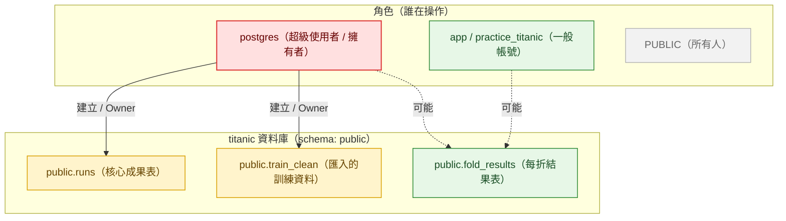
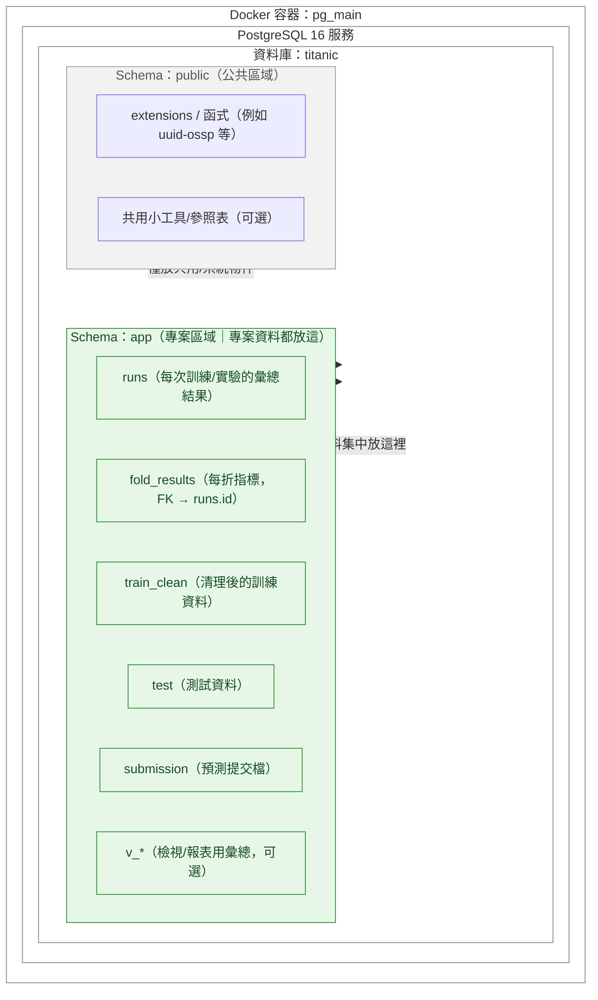
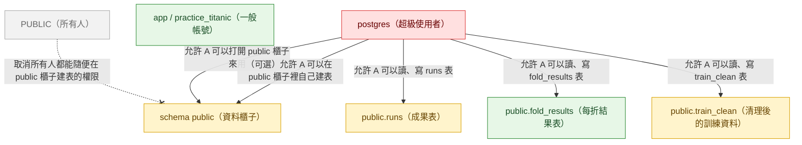
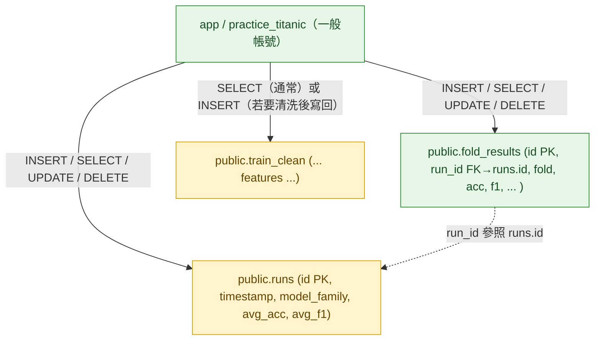
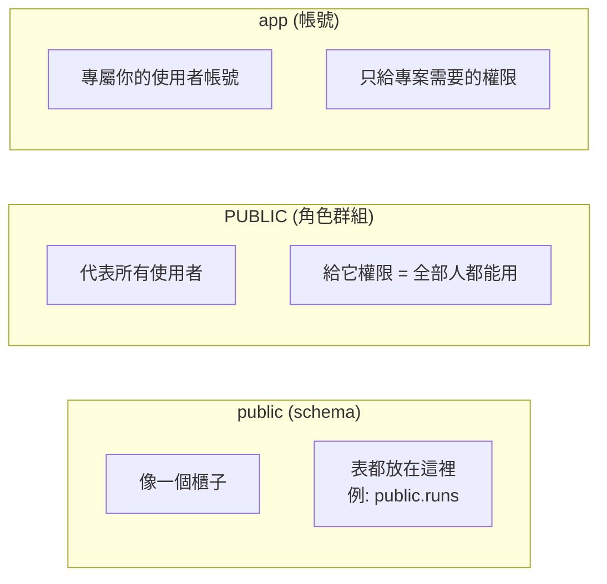

--- 

postgres = 系統管理員，管全部。

app/practice_titanic = 專案成員，用來日常跑 SQL、管理專案表。

PUBLIC = 廣義的所有人，最好收掉建表權限，避免亂象。

--- 

postgres 是超管，擁有所有東西。
### 1. postgres（超級使用者）

就像房東＋管理員合一，

這個帳號天生什麼都能做：建資料庫、建資料櫃子（schema）、建資料表、改密碼、刪資料……全部權限都在它手上。

一般只拿來做「管理」或「設定」，不會每天拿來跑專案。

### 2. app / practice_titanic（專案用帳號）

想像成「專案成員」：房東（postgres）給這個人一把鑰匙，可以打開 public 這個櫃子，裡面有專案的表格。

權限設計成「夠用就好」：

可以打開櫃子 → 查得到表。

可以讀、寫 → 在三張表 (runs / fold_results / train_clean) 裡新增、修改、查詢資料。

如果房東願意，還可以讓他自己在櫃子裡多擺一張新表。

好處：日常分析、匯入匯出資料，全靠這個帳號，安全又不會動到系統設定。

### 3. PUBLIC（所有人）

PostgreSQL 預設會給「所有人」一個權限：大家都能在 public 櫃子裡建表。

這樣做風險很大 → 任何新帳號進來都能隨便加東西，像是公共廚房誰都能塞東西一樣。

所以實務上一定會「收回」這個能力，只讓特定專案帳號（例如 app / practice_titanic）可以動。

換句話說：PUBLIC 最好只保留「能看」的權限，不要「能建」的權限。

--- 

